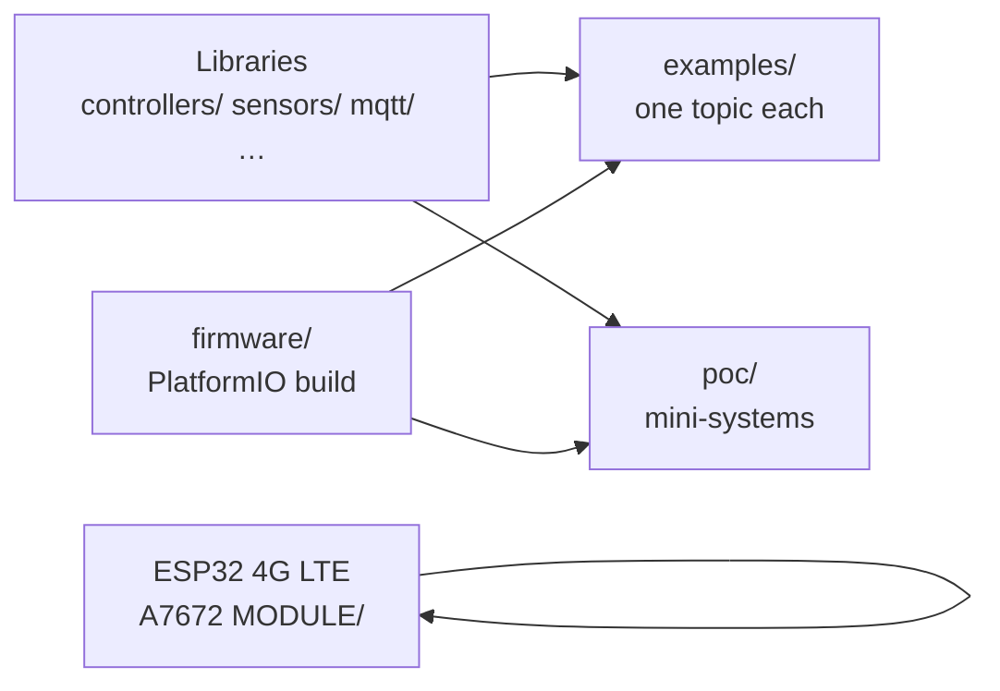

# Embedded & IoT Proof-of-Concept Reference

This public repository is a **reference tree for practical embedded and IoT engineering** on ESP32. It shows how to structure firmware, drivers, and examples so the same patterns can be reused on industrial, agricultural, building, energy, and environmental devices.

It is **not** a weather-station product. Temperature, humidity, wind, rain, and UV drivers exist only as **one category of sensor POCs** beside analog, digital, RTC, and RS-485 devices.

First controller target: **ESP32**. Build system: **PlatformIO** (Arduino-ESP32 framework). ESP-IDF is a documented future option, not the v1 default.

## Start here

**New to this repo?**

1. **[docs/RUN.md](docs/RUN.md)** — copy-paste commands so **build & run actually work**
2. **[docs/GETTING_STARTED.md](docs/GETTING_STARTED.md)** — folder map and which path to pick

**Quick verify (no hardware):**

```powershell
powershell -ExecutionPolicy Bypass -File scripts/setup-local-config.ps1
powershell -ExecutionPolicy Bypass -File scripts/smoke-verify.ps1
```

Linux/macOS: `./scripts/setup-local-config.sh` then `./scripts/smoke-verify.sh`



| I want to… | Go to |
| --- | --- |
| Understand the whole tree | [docs/GETTING_STARTED.md](docs/GETTING_STARTED.md) |
| **Controllers, sensors, industries (scope)** | **[docs/REFERENCE_SCOPE.md](docs/REFERENCE_SCOPE.md)** |
| Flash relay demo (easiest) | `cd firmware` → `pio run -e poc_relay_control -t upload` |
| Browse all demos | [examples/README.md](examples/README.md) |
| 4G A7672 board + MQTT | [ESP32 4G LTE A7672 MODULE/README.md](ESP32%204G%20LTE%20A7672%20MODULE/README.md) |
| STM32 industrial starter | `cd firmware` → `pio run -e example_stm32_edge` |
| Raspberry Pi MQTT gateway | [edge/raspberry_pi/README.md](edge/raspberry_pi/README.md) |
| Run tests without hardware | `cd firmware` → `pio test -e native` |

---

## Scope at a glance

| Platforms | Sensor buses | Industries |
| --- | --- | --- |
| **ESP32** (full) · **STM32** (starter) · **Raspberry Pi** (edge Python) | GPIO, ADC, I2C, pulse, RS-485, UART | Agriculture · Water · Industrial · Building · Energy |

Details: **[docs/REFERENCE_SCOPE.md](docs/REFERENCE_SCOPE.md)** · STM32: `pio run -e example_stm32_edge` · Pi: [`edge/raspberry_pi/`](edge/raspberry_pi/)

## What this repository demonstrates

| Area | Patterns |
| --- | --- |
| Controllers | ESP32 HAL for GPIO, UART, I2C, SPI, ADC, watchdog |
| Sensors | Shared `ISensor` interface, injected buses, category drivers |
| Buses | UART, I2C, SPI, RS-485, Modbus RTU |
| Cellular | Modular Quectel AT core: SIM, registration, PDP, HTTP/HTTPS, MQTT, GNSS, NTP |
| MQTT | Publish/subscribe, JSON telemetry, QoS, retain, LWT, backoff, commands |
| RTOS | FreeRTOS tasks, queues, mutexes, semaphores, event groups, timers, WDT, state machines |
| Operations | Diagnostics, configuration placeholders, OTA *concepts* |
| Quality | Native unit tests, GitHub Actions, secret scanning |

## Architecture

```text
Application (examples / POC)
    → Services (telemetry, commands, MQTT, cellular, diagnostics)
        → HAL / drivers (sensors, Quectel AT, bus helpers)
            → Hardware (ESP32, sensors/actuators, modem)
```

Includes travel **downward only**. See [docs/architecture](docs/architecture/README.md).

## Repository layout

```text
firmware/           PlatformIO workspace and config placeholders
controllers/        SoC HAL — esp32 (full), stm32 (starter)
edge/               Linux edge runtimes — raspberry_pi (Python MQTT)
sensors/            Generic sensor/actuator drivers
communication/      UART / I2C / SPI / RS-485 / Modbus helpers
cellular/quectel/   Original AT stack and feature modules
mqtt/               ESP32-hosted MQTT service helpers
rtos/               FreeRTOS helpers and portable state machines
poc/                Composed mini-systems
examples/           Single-concern demos
ESP32 4G LTE A7672 MODULE/  Standalone 4G MQTT gateway (A7672 / SIM7672)
docs/               Engineering documentation
diagrams/           Architecture diagrams (Mermaid + SVG)
tests/              Native Unity tests, fixtures, hardware checklists
.github/workflows/  CI
```

## ESP32 4G LTE automation gateway

For **remote sites without Wi-Fi**, the [`ESP32 4G LTE A7672 MODULE`](ESP32%204G%20LTE%20A7672%20MODULE/) project publishes **real-time automation telemetry** over cellular MQTT.

- Modem: A7672 / SIM7672S (VVM501-class board)
- You configure: MQTT broker, device ID, APN (`config.local.env`)
- You customize: sensor payload — temperature, tank level, digital I/O, Modbus meters, flow pulses, etc.

See [docs/cellular/esp32-a7672-gateway.md](docs/cellular/esp32-a7672-gateway.md) for sensor integration examples and architecture.

## Prerequisites

- ESP32 DevKit-class board (or equivalent)
- [PlatformIO Core](https://platformio.org/install/cli)
- USB serial driver for your board
- Optional: Quectel LTE module on UART, RS-485 transceiver, I2C sensors, relay module

## Quick start (relay command POC)

The original serial relay sketch is preserved at [`relaycontrol.cpp`](relaycontrol.cpp) and migrated into a layered POC.

1. Connect two **active-low** relay inputs to **GPIO 27** and **GPIO 14** (example pins; change in the POC if your board differs).
2. Copy configuration placeholders if you will use Wi-Fi/MQTT/cellular later:

```text
copy firmware\include\config.example.h firmware\include\config.local.h
```

On Unix: `cp firmware/include/config.example.h firmware/include/config.local.h`

3. Build and flash:

```text
cd firmware
pio run -e poc_relay_control -t upload
pio device monitor -e poc_relay_control
```

4. Serial commands (115200 baud), unchanged from the original POC:

```text
ON1   OFF1   ON2   OFF2
```

`config.local.h` is gitignored. Never put real passwords, APN credentials, or private keys in git.

## Build other environments

All firmware environments are defined in [`firmware/platformio.ini`](firmware/platformio.ini). Examples:

```text
cd firmware
pio run -e example_at_handling
pio run -e example_mqtt_publish
pio run -e example_rtos_tasks
pio run -e poc_sensor_telemetry
```

Host (no hardware):

```text
cd firmware
pio test -e native
```

## Configuration and secrets

This is a **public** repository.

- Templates live in [`firmware/include/config.example.h`](firmware/include/config.example.h).
- Include them through [`firmware/include/iotpoc_config.h`](firmware/include/iotpoc_config.h).
- Values must remain placeholders in commits (`YOUR_WIFI_SSID`, `YOUR_APN`, `YOUR_MQTT_URI`).
- See [SECURITY.md](SECURITY.md).

## Documentation

- **[Run guide](docs/RUN.md)** — step-by-step build, flash, and dry-run for every platform
- **[Getting started](docs/GETTING_STARTED.md)** — repo map, pick-your-path, build layout
- **[Reference scope](docs/REFERENCE_SCOPE.md)** — ESP32 / STM32 / Raspberry Pi, sensor types, industry use cases
- [Controllers & edge](docs/controllers/README.md) — STM32 firmware, Pi Python gateway
- [PlatformIO workspace](firmware/README.md) — why `cd firmware` and `src_dir = ..`
- [Examples index](examples/README.md) — all `example_*` environments
- [POC index](poc/README.md) — composed mini-systems
- [Architecture](docs/architecture/README.md)
- [Hardware](docs/hardware/README.md)
- [Sensors](docs/sensors/README.md)
- [Cellular (Quectel)](docs/cellular/README.md)
- [ESP32 A7672 4G gateway](docs/cellular/esp32-a7672-gateway.md)
- [MQTT](docs/mqtt/README.md)
- [FreeRTOS](docs/rtos/README.md)
- [Troubleshooting](docs/troubleshooting/README.md)
- [Diagrams](diagrams/README.md)

## Third-party libraries

On-device MQTT examples may pull MIT-compatible PlatformIO dependencies (version-pinned in `platformio.ini`), such as PubSubClient. Core parsers, Modbus CRC, backoff, and telemetry JSON are original to this repository.

## License

[MIT](LICENSE) © 2025 Suraj Rathod

## Contributing

See [CONTRIBUTING.md](CONTRIBUTING.md) and the [Code of Conduct](CODE_OF_CONDUCT.md).
