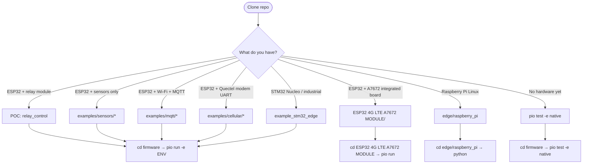
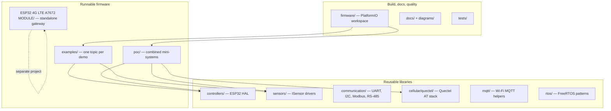

# Getting started

This guide explains **what each part of the repository is for** and **where to start** based on your hardware and goal.

This is a **reference / learning repository**, not a single shipped product. Reusable libraries live in domain folders; runnable firmware lives in `examples/`, `poc/`, or the standalone 4G gateway project.

---

## Start here — pick your path



| Your goal | Start here | Build command |
| --- | --- | --- |
| Learn GPIO / relay control | [`poc/relay_control/`](../poc/relay_control/) | `cd firmware` → `pio run -e poc_relay_control -t upload` |
| Read a sensor (ADC, I2C, digital) | [`examples/sensors/`](../examples/sensors/) | `pio run -e example_sensor_analog` (or `_digital`, `_temp_humidity`, `_rs485`) |
| MQTT over Wi-Fi | [`examples/mqtt/`](../examples/mqtt/) | `pio run -e example_mqtt_publish` |
| Quectel LTE modem (AT commands) | [`examples/cellular/`](../examples/cellular/) | `pio run -e example_at_handling` |
| Combined mini-system | [`poc/`](../poc/) | `pio run -e poc_sensor_telemetry` |
| STM32 edge (Nucleo / industrial MCU) | [`examples/platforms/stm32_edge/`](../examples/platforms/stm32_edge/) | `pio run -e example_stm32_edge` |
| Raspberry Pi MQTT gateway | [`edge/raspberry_pi/`](../edge/raspberry_pi/) | `python telemetry_gateway.py --dry-run --once` |
| 4G A7672 board + MQTT telemetry | [`ESP32 4G LTE A7672 MODULE/`](../ESP32%204G%20LTE%20A7672%20MODULE/) | `cd "ESP32 4G LTE A7672 MODULE"` → `pio run -t upload` |
| Run tests without hardware | [`tests/native/`](../tests/native/) | `cd firmware` → `pio test -e native` |
| **Verify all (smoke script)** | [`scripts/smoke-verify.ps1`](../scripts/smoke-verify.ps1) | `powershell -File scripts/smoke-verify.ps1` |

Full environment list: [`firmware/platformio.ini`](../firmware/platformio.ini).

**Scope lock:** supported controllers, sensor checklist, and industry mapping (agriculture, water, industrial, building, energy) → **[REFERENCE_SCOPE.md](REFERENCE_SCOPE.md)**.

---

## How the repository is organized

Think of the tree in **three layers**:



### Folder reference

| Folder | Purpose | Edit when… |
| --- | --- | --- |
| [`firmware/`](../firmware/) | PlatformIO workspace. **Always `cd firmware` before `pio run`** for main repo examples/POCs | Adding a new `[env:...]` in `platformio.ini` |
| [`controllers/`](../controllers/) | ESP32 HAL (full), **STM32 HAL (starter)** | Changing board abstraction |
| [`edge/`](../edge/) | **Raspberry Pi** Python MQTT gateway | Linux edge / aggregation |
| [`sensors/`](../sensors/) | Generic sensor drivers (`ISensor` interface) | Adding a new sensor category |
| [`communication/`](../communication/) | Bus helpers: UART framing, I2C registers, Modbus CRC, RS-485 | Adding a protocol helper |
| [`cellular/quectel/`](../cellular/quectel/) | **Quectel** modem AT parser, state machine, HTTP/MQTT-AT/GNSS | Working with Quectel on UART |
| [`mqtt/`](../mqtt/) | ESP32 **Wi-Fi** MQTT client, topics, commands, JSON telemetry | MQTT service patterns |
| [`rtos/`](../rtos/) | FreeRTOS queues, mutexes, backoff, app state machines | Task / timing patterns |
| [`examples/`](../examples/) | **Single-concern** demos (one feature to learn) | Learning or copying one pattern |
| [`poc/`](../poc/) | **Composed** mini-systems (relay, telemetry, cellular path) | End-to-end reference apps |
| [`ESP32 4G LTE A7672 MODULE/`](../ESP32%204G%20LTE%20A7672%20MODULE/) | **Standalone** 4G gateway (TinyGSM, not Quectel stack) | A7672/SIM7672 board + cellular MQTT |
| [`docs/`](../docs/) | Engineering guides | Understanding architecture |
| [`tests/`](../tests/) | Native Unity tests (run on PC) | Adding parser/driver tests |

---

## Important: two cellular paths

Newcomers often ask which cellular code to use. They are **different hardware stacks**:

| Path | Folder | Modem style | When to use |
| --- | --- | --- | --- |
| **Quectel AT core** | `cellular/quectel/` + `examples/cellular/` | Quectel EC2xx-style, custom AT parser | External Quectel module on ESP32 UART |
| **A7672 gateway** | `ESP32 4G LTE A7672 MODULE/` | TinyGSM + SIM7600 profile | Integrated ESP32 + A7672/SIM7672 board (VVM501 class) |

Do not mix the two in one build without planning — they use different libraries and config files.

Details: [cellular/README.md](cellular/README.md) and [cellular/esp32-a7672-gateway.md](cellular/esp32-a7672-gateway.md).

---

## How building works (main repo)

PlatformIO project lives in **`firmware/`**, but source is selected from the **repository root**:

```text
IOT-POC/
├── firmware/
│   ├── platformio.ini      ← environments list (example_*, poc_*)
│   └── include/            ← config.example.h, iotpoc_config.h
├── examples/sensors/analog/main.cpp   ← picked by build_src_filter
├── sensors/                ← linked as libraries (lib_extra_dirs)
└── controllers/
```

Each environment in `platformio.ini` compiles **one** folder:

```ini
[env:example_sensor_analog]
build_src_filter = -<*> +<examples/sensors/analog/>
```

So: libraries are shared; only the selected `main.cpp` tree is built.

See also: [firmware/README.md](../firmware/README.md).

---

## Configuration and secrets

| Project | Config file | Upload |
| --- | --- | --- |
| Main repo (Wi-Fi / Quectel examples) | Copy `firmware/include/config.example.h` → `config.local.h` | Compiled in (no SPIFFS step) |
| A7672 4G gateway | Copy `data/config.local.env.example` → `data/config.local.env` | `pio run -t uploadfs` then `pio run -t upload` |

Local config files are **gitignored**. Use placeholders (`YOUR_*`) in commits. See [SECURITY.md](../SECURITY.md).

---

## Suggested learning order

1. **Relay POC** — `poc_relay_control` (GPIO, serial commands)
2. **One sensor example** — `example_sensor_analog` or `example_sensor_digital`
3. **One MQTT example** — `example_mqtt_publish` (after filling Wi-Fi/MQTT in `config.local.h`)
4. **One RTOS example** — `example_rtos_tasks`
5. **Cellular** — only if you have hardware: `example_at_handling` or the A7672 gateway README

---

## Next steps

- [Reference scope](REFERENCE_SCOPE.md) — controllers, sensors, industry use cases
- [Architecture](architecture/README.md) — layering rules
- [Sensors](sensors/README.md) — `ISensor` contract and categories
- [Hardware](hardware/README.md) — pins and wiring notes
- [Troubleshooting](troubleshooting/README.md) — common build/flash issues
- [Diagrams](../diagrams/README.md) — Mermaid / SVG architecture figures
