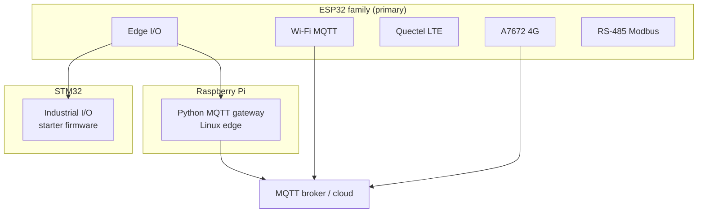
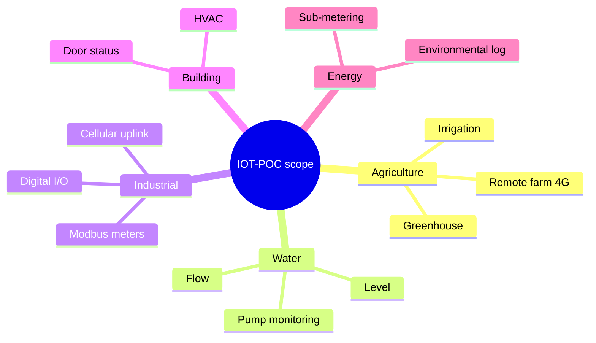

# Reference scope

This page defines **what this repository covers**, **which controllers and sensors fit**, and **how common industry use cases map** to the code here.

It is the **scope lock** for v1: you can extend drivers and payloads, but the architecture and controller targets below are the intended design center.

---

## Supported controllers

Three **platform families**. ESP32 is fully built out; STM32 and Raspberry Pi are **starter** targets you extend with the same sensor/MQTT patterns.

| # | Platform | Role | Firmware / runtime | Status |
| --- | --- | --- | --- | --- |
| 1 | **ESP32 edge** | GPIO, ADC, I2C, relay, sensors | PlatformIO `examples/`, `poc/` | **Full** |
| 2 | **ESP32 Wi-Fi MQTT** | LAN gateway → broker | `examples/mqtt/`, `mqtt/` | **Full** |
| 3 | **ESP32 + Quectel** | Cellular AT stack | `cellular/quectel/`, `examples/cellular/` | **Full** |
| 4 | **ESP32 + A7672 board** | Integrated 4G MQTT | [`ESP32 4G LTE A7672 MODULE/`](../ESP32%204G%20LTE%20A7672%20MODULE/) | **Full** |
| 5 | **ESP32 RS-485** | Modbus field bus | `sensors/rs485/`, `communication/modbus/` | **Full** |
| 6 | **STM32** | Industrial MCU node (Nucleo / Blue Pill) | `pio run -e example_stm32_edge` | **Starter** |
| 7 | **Raspberry Pi** | Linux edge gateway, aggregation | `edge/raspberry_pi/telemetry_gateway.py` | **Starter** |

| Doc | Path |
| --- | --- |
| ESP32 HAL | [`controllers/esp32/`](../controllers/esp32/) |
| STM32 HAL + build | [docs/controllers/stm32.md](controllers/stm32.md) |
| Raspberry Pi edge | [docs/controllers/raspberry_pi.md](controllers/raspberry_pi.md) |
| All controllers | [docs/controllers/README.md](controllers/README.md) |

**Also available:** `native` host tests (`pio test -e native`) — development only, not a field controller.

**Future:** ESP-IDF default, RP2040, production OTA/TLS stacks.

---

## Sensor types

### Built-in driver categories (this repo)

Implement `ISensor` or reuse bus patterns from these folders:

| Sensor type | Bus / interface | Driver folder | Example use |
| --- | --- | --- | --- |
| Analog voltage / 4–20 mA scaled | ADC | `sensors/analog` | Level, pressure, soil probe |
| Digital input (contact) | GPIO | `sensors/digital` | Door, limit switch, pump run status |
| Temperature & humidity | I2C register map | `sensors/temperature_humidity` | Cold room, greenhouse, HVAC |
| Barometric pressure | I2C | `sensors/pressure` | Altitude, weather, tank vent |
| Real-time clock chip | I2C | `sensors/rtc` | Timestamped logs |
| Pulse / frequency | GPIO pulse | `sensors/wind_speed` | **Flow meter**, anemometer, tachometer |
| Angle / position (analog) | ADC | `sensors/wind_direction` | Vane, potentiometer, dial |
| Accumulator / tip count | Pulse / count | `sensors/rain` | Rain gauge, **totalizer**, batch counter |
| UV index | Analog / injected | `sensors/uv` | Outdoor exposure monitoring |
| Modbus holding registers | RS-485 | `sensors/rs485` + `communication/modbus` | Energy meter, VFD, remote I/O |

`SensorReading` quantities include: temperature, humidity, pressure, voltage, pulse rate, angle, count, UV, digital state, timestamp, raw.

### You can add (same patterns)

| Sensor type | Typical interface | Add via |
| --- | --- | --- |
| Soil moisture | Analog or I2C | New `ISensor` + `analog` or I2C helper |
| Tank level (ultrasonic) | UART or I2C | UART framer or I2C register driver |
| pH / EC (water quality) | Modbus or I2C | `rs485` or new I2C category |
| Gas / smoke alarm | Digital GPIO | `digital` pattern |
| Current clamp / energy | Modbus meter | `rs485` + `examples/cellular` or MQTT path |
| Vibration, load cell | Analog or SPI | `analog` or new SPI helper |
| GPS position | Modem GNSS | `examples/cellular/gnss` or A7672 GNSS AT |

**Rule:** inject bus/pin handles; do not hard-code `Wire` or GPIO inside portable drivers. Document **your** validated register map in the driver folder.

---

## Industry use cases

Same firmware patterns apply across sectors. Pick a **controller profile** (above) and **sensor types** (above).

### Agriculture

| Application | Sensors / I/O | Suggested controller |
| --- | --- | --- |
| Greenhouse climate | Temp, humidity, optional UV | ESP32 edge + Wi-Fi MQTT (#1 + #2) |
| Soil / irrigation | Moisture (ADC), flow pulse, valve relay | ESP32 edge (#1) |
| Rain / weather station slice | Rain count, wind pulse, temp/humidity | ESP32 edge (#1) |
| Remote farm (no Wi-Fi) | Same sensors | A7672 4G gateway (#4) or Quectel (#3) |

### Water & utilities

| Application | Sensors / I/O | Suggested controller |
| --- | --- | --- |
| Tank / reservoir level | 4–20 mA or ultrasonic | ESP32 ADC (#1) |
| Flow & totalizer | Pulse meter | `wind_speed` / pulse pattern (#1) |
| Pump house monitoring | Pressure, run status, faults | Digital + analog (#1) |
| Lift station / remote site | Level + flow + alarms | A7672 MQTT gateway (#4) |
| SCADA meter reading | Modbus registers | RS-485 node (#5) |

### Industrial & factory

| Application | Sensors / I/O | Suggested controller |
| --- | --- | --- |
| Machine run / fault | Digital inputs | ESP32 edge (#1) |
| Line monitoring | Modbus energy, temperature | RS-485 (#5) |
| Alarm / relay control | Digital outputs (relay POC) | `poc/relay_control` (#1) |
| Site without LAN | Telemetry over 4G | Quectel (#3) or A7672 (#4) |

### Building & facilities

| Application | Sensors / I/O | Suggested controller |
| --- | --- | --- |
| HVAC zone | Temp, humidity | I2C (#1) + Wi-Fi MQTT (#2) |
| Access / door status | Magnetic contact | Digital (#1) |
| Energy sub-metering | Modbus | RS-485 (#5) |

### Energy & environment

| Application | Sensors / I/O | Suggested controller |
| --- | --- | --- |
| Solar / genset monitoring | Modbus meter, voltage | RS-485 (#5) |
| Air quality / outdoor | Temp, humidity, UV | Sensor node (#1) |
| Environmental compliance log | Timestamp + sensors | RTC + MQTT (#1 + #2) |

---

## What you can add to this repo

| OK to add | Avoid in public tree |
| --- | --- |
| New `ISensor` category under `sensors/` | Vendor SDK blobs, closed-source libs |
| New `example_*` or `poc_*` environment | Real credentials, APN passwords, broker IPs |
| Payload fields in A7672 `metrics_builder.*` | Customer-specific schemas committed as “the only way” |
| Native tests for parsers/conversions | Copy-paste datasheet register dumps |
| Docs and Mermaid diagrams | Product-specific branding as if this repo is one product |

---

## Quick links

- [Getting started](GETTING_STARTED.md) — clone → pick path → build
- [Sensors](sensors/README.md) — `ISensor` contract
- [Hardware](hardware/README.md) — pins and wiring
- [ESP32 A7672 gateway](cellular/esp32-a7672-gateway.md) — 4G automation telemetry
- [Examples index](../examples/README.md) — all demo environments
