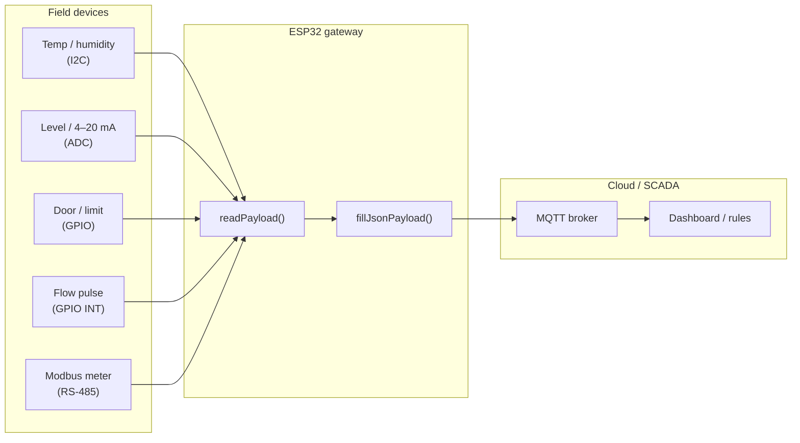
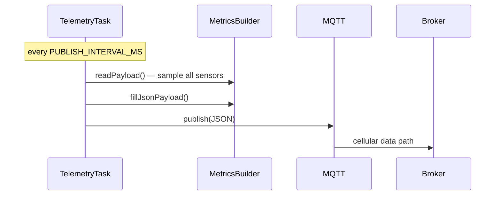

# ESP32 + A7672 4G LTE automation gateway

Standalone PlatformIO project: [`ESP32 4G LTE A7672 MODULE`](../../ESP32%204G%20LTE%20A7672%20MODULE/).

Cellular MQTT gateway for **remote automation** — sites without reliable Wi-Fi can still push **real-time sensor and I/O data** to your broker.

## What it provides

| Built-in | You customize |
| --- | --- |
| 4G registration, GPRS, APN detect | `APN` in `config.local.env` |
| MQTT connect + periodic publish | Broker, topic, credentials |
| FreeRTOS network + telemetry tasks | `PUBLISH_INTERVAL_MS` |
| UTC time from modem | — |
| Blank JSON payload template | **Your sensors and field points** |

There is **no fixed payload schema**. You define fields in `src/metrics/metrics_builder.*`.

## Sensor and I/O integration (automation examples)

Wire sensors to ESP32 (or RS-485 devices on UART) and read them inside `MetricsBuilder::readPayload()`.



### Common automation inputs

| Measurement | Typical hardware | ESP32 interface | Notes |
| --- | --- | --- | --- |
| Temperature | SHT / BME / DS18B20 | I2C or 1-Wire | Room, cold storage, pipe wrap |
| Humidity | SHT / BME | I2C | HVAC, greenhouse |
| Tank / silo level | Ultrasonic, radar, float | ADC or Modbus | Scale raw value to % or meters |
| Door / gate open | Magnetic reed, limit switch | GPIO input | Use pull-up; debounce in software |
| Motor run / fault | Aux contact, VFD relay | GPIO input | Map to `motor_run`, `alarm` |
| Flow rate / total | Pulse output meter | GPIO interrupt | Count pulses → L/min or m³ |
| Pressure | 4–20 mA transmitter | ADC + shunt | Scale to bar / psi |
| Energy / power | Modbus meter | RS-485 UART | Reuse Modbus patterns from `communication/` |
| Remote I/O | Modbus RTU module | RS-485 | Digital + analog blocks off-board |

### Link to main repo drivers

The [`sensors/`](../../sensors/) tree has reusable **ISensor** drivers and bus helpers. For this gateway you can:

1. **Copy/adapt** a driver into the gateway project, or
2. **Call driver code** from `readPayload()` if you add the library path to `platformio.ini`

Relevant patterns in this repository:

| Need | See |
| --- | --- |
| I2C register sensors | `sensors/temperature_humidity`, `sensors/pressure` |
| GPIO digital | `sensors/digital`, `controllers/digital_io` |
| Analog voltage | `sensors/analog` |
| Pulse / frequency | `sensors/wind_speed` (reusable for flow) |
| Modbus RTU | `sensors/rs485`, `communication/modbus` |
| MQTT JSON shape ideas | `mqtt/telemetry`, `examples/mqtt/json_telemetry` |

### Real-time publish loop



Tune interval in `data/config.local.env` (e.g. `5000` for 5 s, `60000` for 1 min).

## Quick start

```powershell
cd "ESP32 4G LTE A7672 MODULE"
copy data\config.local.env.example data\config.local.env
# edit config.local.env — MQTT, DEVICE_ID, APN
pio run -t uploadfs
pio run -t upload
pio device monitor
```

Full wiring, config keys, and troubleshooting: [project README](../../ESP32%204G%20LTE%20A7672%20MODULE/README.md).

## Configuration

Secrets live in **`data/config.local.env`** (gitignored). Template keys in `data/config.env`.

Never commit broker passwords or production device IDs.

## Related docs

- [Sensors](../sensors/README.md) — driver contract and categories
- [MQTT](../mqtt/README.md) — topic and telemetry patterns
- [Hardware](../hardware/README.md) — ESP32 pin planning
- [FreeRTOS](../rtos/README.md) — task design notes
